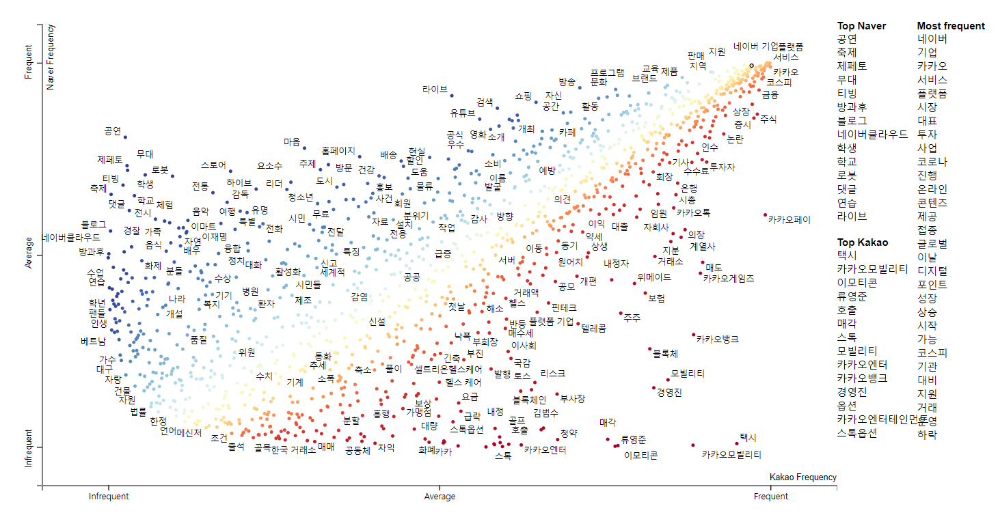

# Naver-VS-Kakao
This is for data analysis and visualization competition in [dacon](https://dacon.io/). Dacon is a kind of company carrying out data competition in South Korea like Kaggle. In this project, I used scatter text to compare with keywords between Naver and Kakao. 

Since the competition is carried out in Korea, the comments on the notebooks were written in Korean. [submited link](https://dacon.io/competitions/official/235866/codeshare/4187?page=1&dtype=random)
